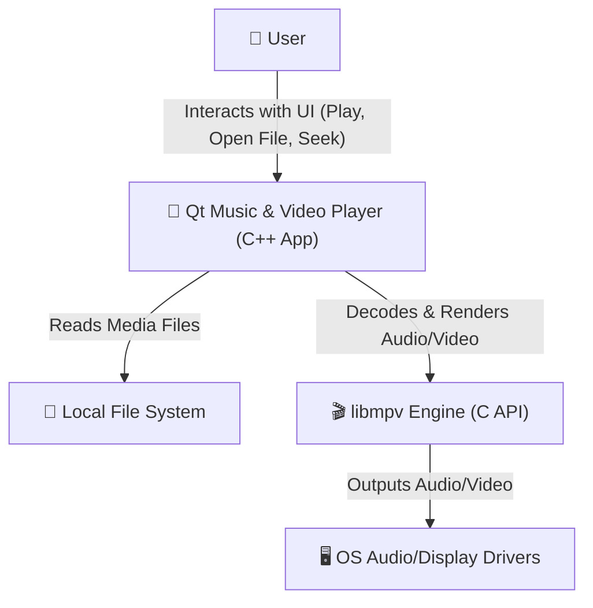
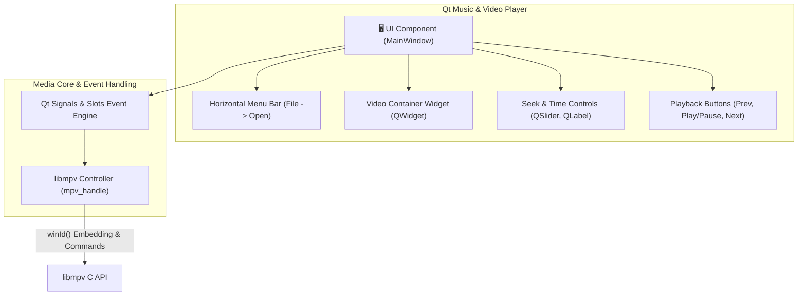
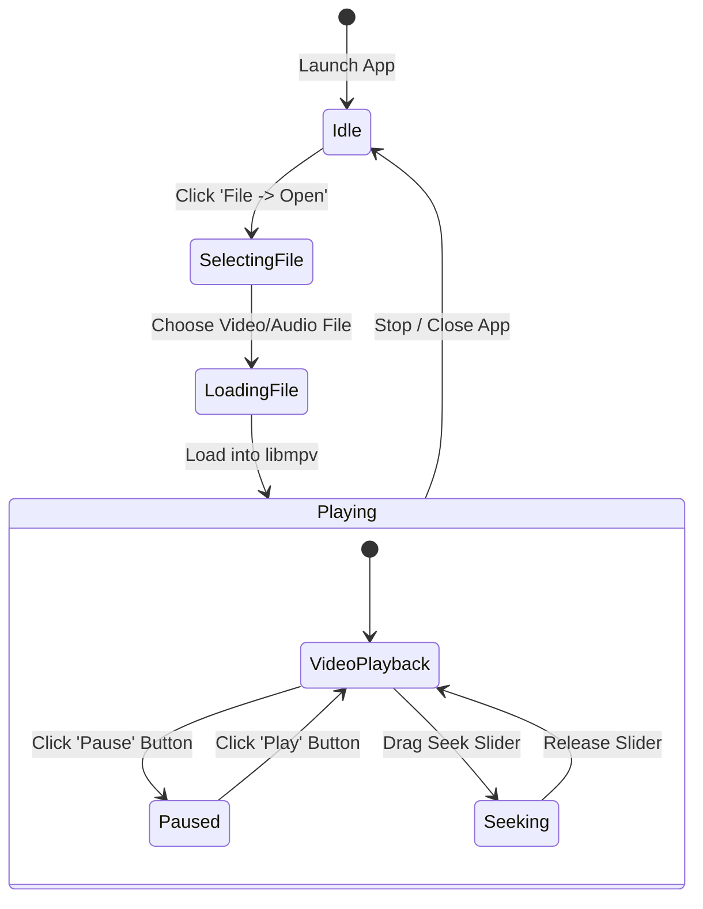
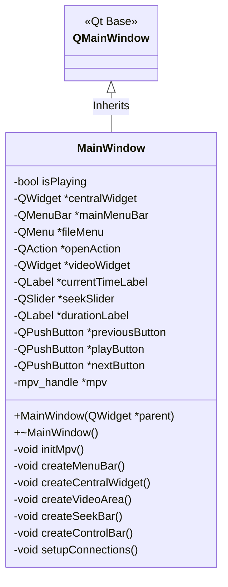
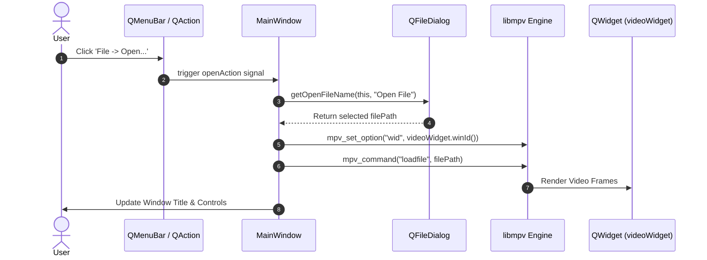

# Architecture & Software Design Document

## 1. Overview
This document outlines the software design and architecture of the **Qt Music & Video Player Application** built using **Qt 6 (C++)** and **libmpv**.

---

## 2. System Context Diagram
Visualizes how the user interacts with the application and external system dependencies.

---

## 3. C4 Component Diagram
Details the internal components of the Qt application architecture.

---

## 4. User Interaction & Playback Flow
Illustrates the user workflow from launching the application to playing media.

---

## 5. Class Diagram
Describes the object-oriented structure of the Qt C++ application.

---

## 6. Event & Signal Sequence Diagram
Traces the sequence of calls when the user opens and plays a file.

