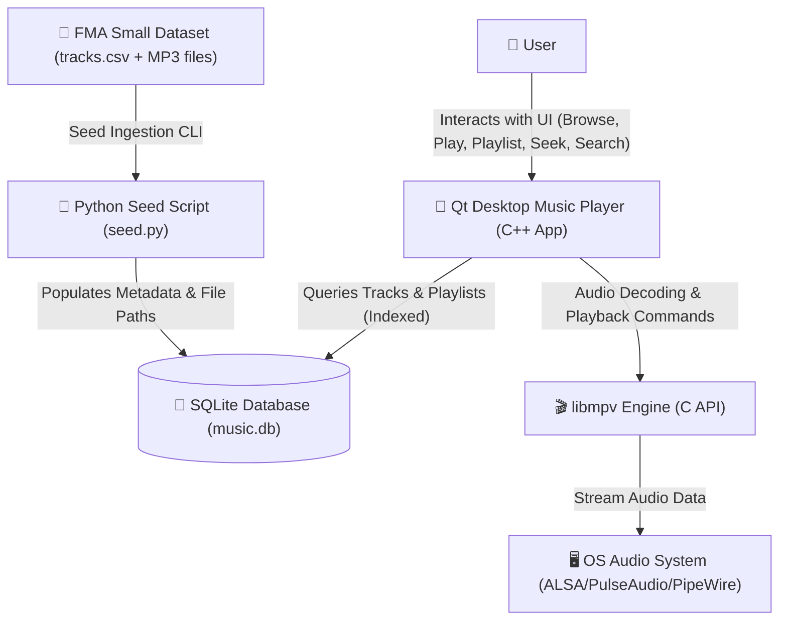
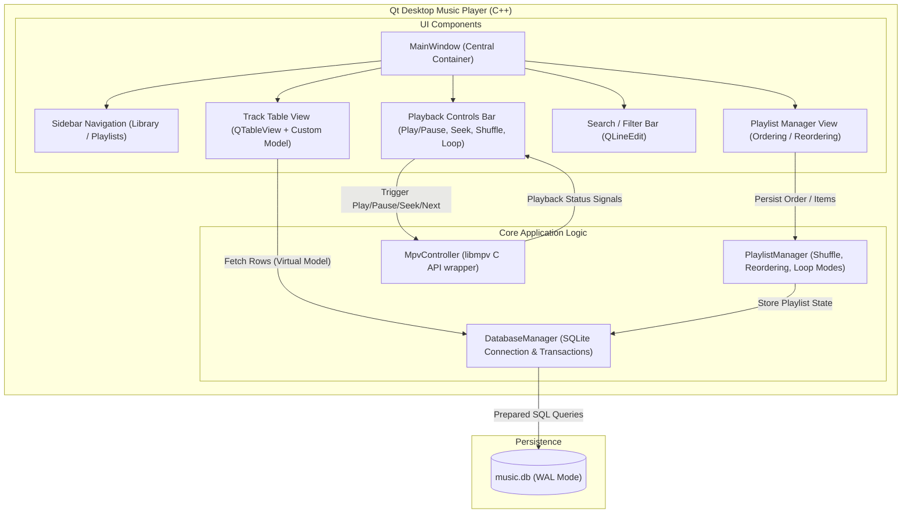
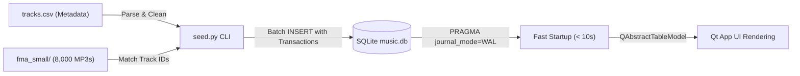
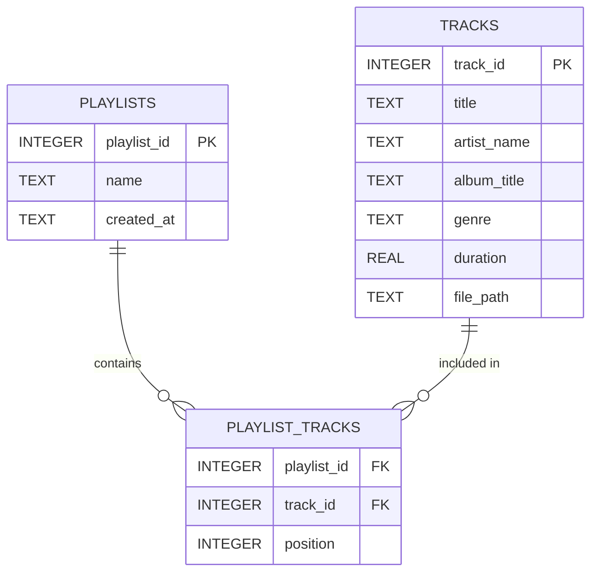
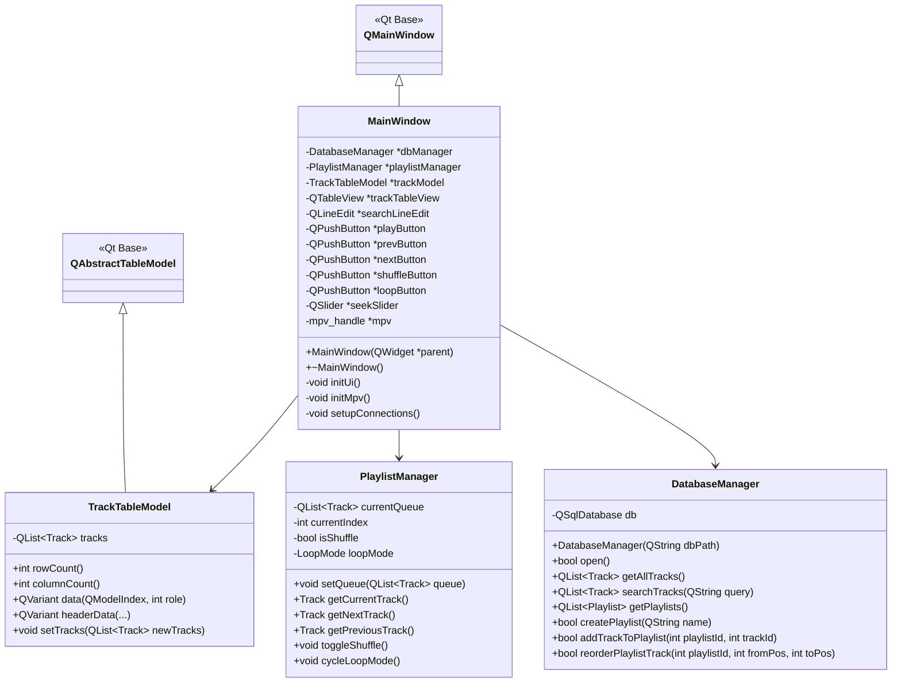
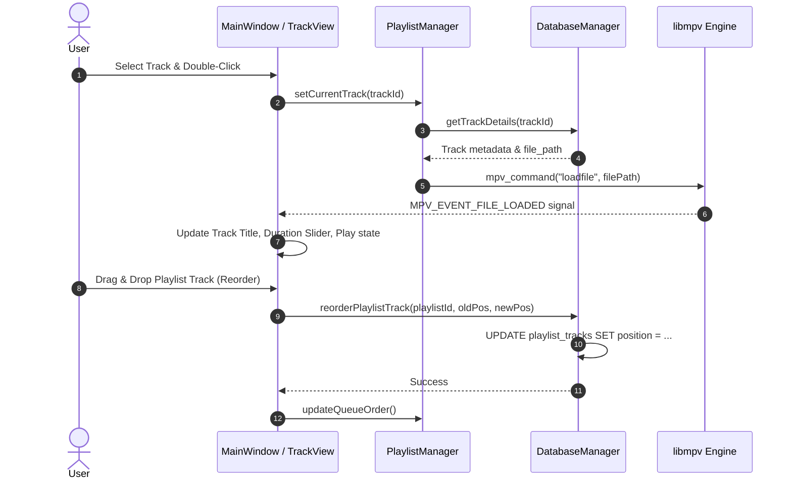

# Architecture & Software Design Document

## 1. Overview
This document outlines the software design and architecture of the **FMA Desktop Music Player** application built using **Qt 6 (C++)**, **libmpv**, and **SQLite**. The system is designed to provide high-performance local browsing and playback of the **FMA Small Dataset (8,000 tracks)** with sub-second responsiveness, playlist management, shuffle, loop, and instant search capabilities.

---

## 2. System Context Diagram (`context`)
Visualizes the external dataset, seed pipeline, application components, and operating system dependencies.

---

## 3. C4 Component Diagram (`C4`)
Details the internal component architecture of the Qt C++ application.

---

## 4. Data Flow Diagram (`flow`)
Illustrates how the FMA dataset is ingested into the SQLite store and accessed by the client.

---

## 5. Entity-Relationship Diagram (`ERD`)
Defines the relational SQLite database schema.

---

## 6. Class Diagram (`class`)
Describes the object-oriented structure of the Qt C++ application.

---

## 7. Sequence Diagram (`sequence`)
Traces user events from clicking a song to audio decoding and reordering.

